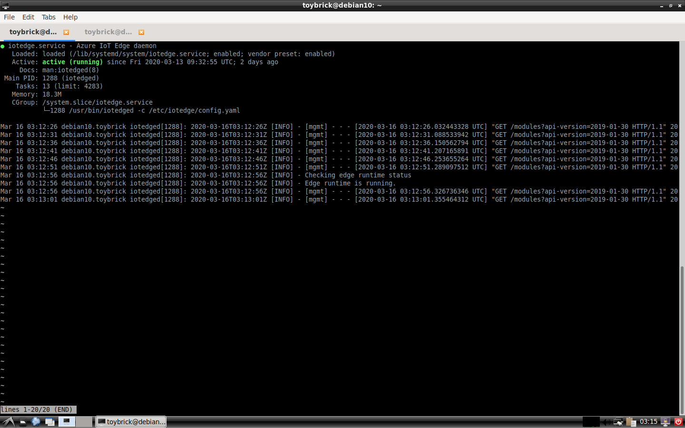
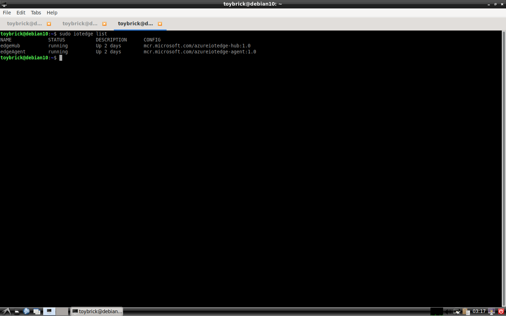

*We highly recommend keeping this document current, and Microsoft reserves a right to remove devices and documents from the Azure IoT Device Catalog if document contains broken URL links, incorrect information etc.*

Run a simple python sample on Toybrick AI Board device running Debian10.
===
---

# Table of Contents

-   [Introduction](#Introduction)
-   [Step 1: Prerequisites](#Prerequisites)
-   [Step 2: Prepare your Device](#PrepareDevice)
-   [Step 3: Manual Test for Azure IoT Edge on device](#Manual)
-   [Step 4: Next Steps](#NextSteps)
-   [Step 5: Troubleshooting](#Step-5-Troubleshooting)

# Instructions for using this template

-   Replace the text in {placeholders} with correct values.
-   Delete the lines {{enclosed}} after following the instructions enclosed between them.
-   It is advisable to use external links, wherever possible.
-   Remove this section from final document.

# Introduction

**About this document**

This document describes how to connect Toybrick AI Board device running Debian10 with Azure IoT Edge Runtime pre-installed and Device Management. This multi-step process includes:

-   Configuring Azure IoT Hub
-   Registering your IoT device
-   Build and Deploy client component to test device management capability 

# Step 1: Prerequisites

You should have the following items ready before beginning the process:

-   [Prepare your development environment][setup-devbox-linux]
-   [Setup your IoT hub](https://account.windowsazure.com/signup?offer=ms-azr-0044p)
-   [Provision your device and get its credentials][lnk-manage-iot-hub]
-   [Sign up to IOT Hub](https://account.windowsazure.com/signup?offer=ms-azr-0044p)
-   [Add the Edge Device](https://docs.microsoft.com/en-us/azure/iot-edge/quickstart-linux)
-   [Add the Edge Modules](https://docs.microsoft.com/en-us/azure/iot-edge/quickstart-linux#deploy-a-module)
-   Toybrick AI Board device.
-   {{Please specify if any other software(s) or hardware(s) are required.}}

# Step 2: Prepare your Device

-   Mail to toybrick@rock-chips.com or visit the websit as below for help:
    http://t.rock-chips.com/wiki.php

# Step 3: Manual Test for Azure IoT Edge on device

This section walks you through the test to be performed on the Edge devices running the Linux operating system such that it can qualify for Azure IoT Edge certification.

## 3.1 Edge RuntimeEnabled (Mandatory)

**Details of the requirement:**

The following components come pre-installed or at the point of distribution on the device to customer(s):

-   Azure IoT Edge Security Daemon
-   Daemon configuration file
-   Moby container management system
-   A version of `hsmlib` 

*Edge Runtime Enabled:*

**Check the iotedge daemon command:** 

Open the command prompt on your IoT Edge device , confirm that the Azure IoT edge Daemon is under running state

    systemctl status iotedge

 

Open the command prompt on your IoT Edge device, confirm that the module deployed from the cloud is running on your IoT Edge device

    sudo iotedge list

  

Please contact engineering support on **<mailto:iotcert@microsoft.com>** for help with troubleshooting.
  
[setup-devbox-linux]: https://github.com/Azure/azure-iot-sdk-c/blob/master/doc/devbox_setup.md
[lnk-setup-iot-hub]: ../setup_iothub.md
[lnk-manage-iot-hub]: ../manage_iot_hub.md
